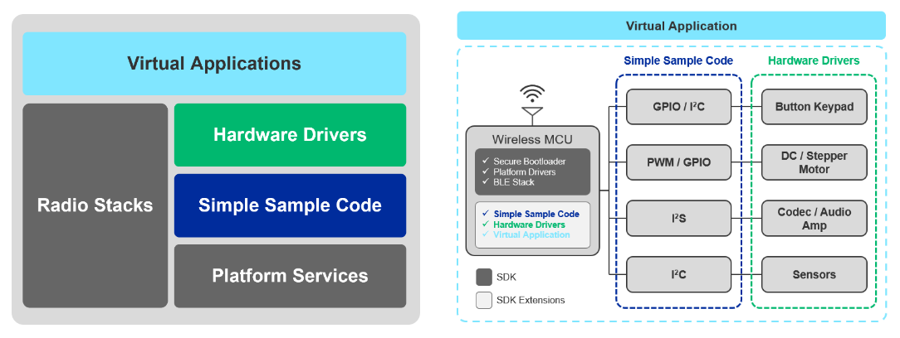
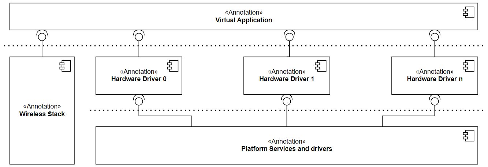
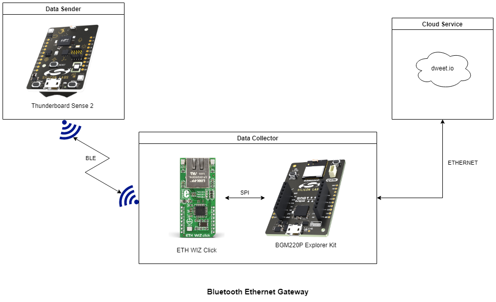
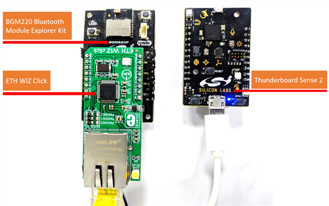
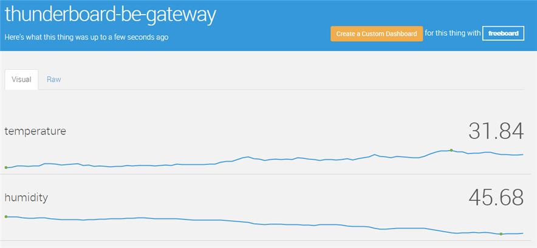

# Overview
The **Application Examples Program (AEP)** is an umbrella term that includes the different promotion and enablement HW drivers, virtual applications, or reference designs.

The application examples are hosted on Github [here](https://github.com/SiliconLabs/application_examples).

Strong emphasis is put on a building block concept, where these can be combined and people can experiment with even more complex applications by reusing these sample codes. The aim is to extend the operation to 3rd party HW platforms/ecosystems as well, not just supporting our development kits.

**As the go-to provider for IoT solutions, we provide developers at all levels with easy-to-use, accessible application examples they can use to speed up their developments and get to market faster.**

## Simple Sample Code

Simple sample code is the most basic product from the AEP program portfolio. Those mainly intend to demonstrate peripherals and low-level platform components (NVM3, crypto, BL).

The goal is to provide a comprehensive set of examples demonstrating their features from different angles for different purposes.

## Hardware Driver

Hardware drivers are basic drivers for external hardware such as sensors, displays, or transmitters that would commonly be used with Silicon Labs products.

The scope of the hardware driver development is to provide feature-rich basic drivers for the market-leading development shields (Sparkfun Qwiic, MikroE Click platforms) commonly used for rapid prototyping by professionals and hobbyists for university and hobby projects.

Those mainly intend to provide basic building blocks for application development.

## Virtual Application

Virtual application is a higher abstraction layer, and it intends to promote the capabilities of hardware drivers integrated into a wireless stack like BLE.

Virtual applications are either wireless or mostly wireless stack applications using simple sample codes and hardware drivers to promote the platform and the AEP component features. Those applications form ready-to-build projects like Simplicity Studio projects.

Complex virtual applications typically provide solutions for popular IoT products, like smart door lock, speech controlling, and so on.

## Example - Bluetooth Ethernet Gateway Application

### Overview

This project aims to implement a simple Bluetooth-Ethernet Thin Gateway, wherein the sensor measures and collects data from the device's environment, and the gateway request the results via BLE.

When the device is connected to a sensor peripheral, the gateway reads the BLE characteristics to retrieve the measured temperature and humidity. The measurement results are uploaded to dweet.io via the Ethernet Click board.

### Hardware Setup

The ETH WIZ Click can be plugged into the BGM220 Bluetooth Module Explorer Kit via the mikroBus socket.

### Cloud Service

The Thunderboard Sense 2 development kit measure the temperature and humidity values. These values are transmitted via BLE from the data sender device to the data collector environment.

The measured environment data are transferred to the cloud service via an Ethernet connection.

The transmitted values can be visualized on the graphical interface of the cloud service.

