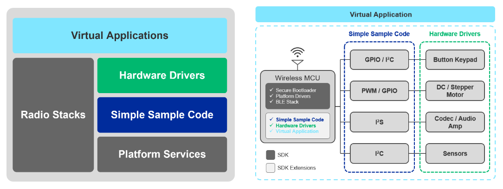

# What is Application Examples Program?

**Application Examples Program (AEP)** is an umbrella term that includes the different promotion and enablement HW drivers, virtual applications or reference designs. 

Strong emphases is put on a building block concept, where these can be combined and people can experiment even more complex applications reusing these sample codes. The aim is to extend the operation to 3rd party HW platforms / ecosystems as well, not just supporting our development kits.

As the go-to provider for IoT solutions, we provide developers at all levels with an easy to use, accessible application examples they can use to speed their developments and get to market faster.

## Hardware Driver
Hardware drivers are basic drivers for external hardware such as sensors, displays, or transmitters that would commonly be used with Silicon Labs products.

The scope of the hardware driver development is to provide feature-rich basic drivers for the market-leading development shields (Sparkfun Qwiic, MikroE Click platforms) commonly used for rapid prototyping by professionals and hobbyists for university and hobby projects. Focusing

Those mainly intend to provide basic building blocks for application development.

