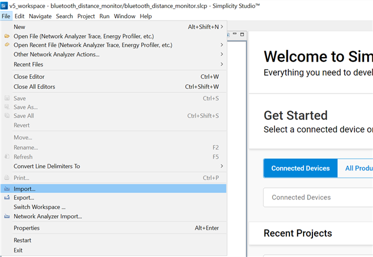
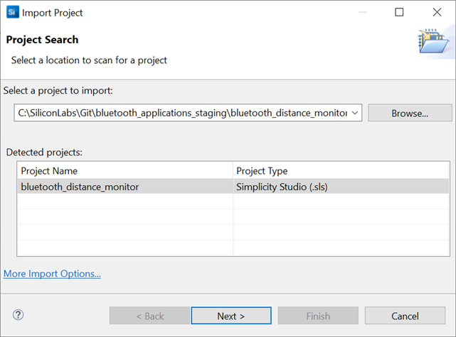
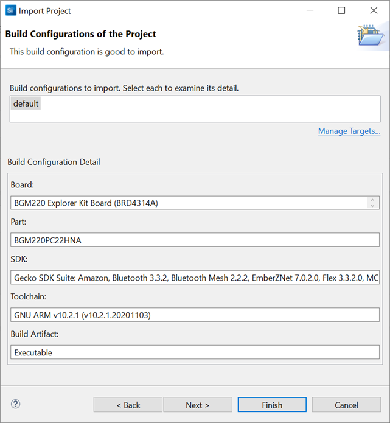
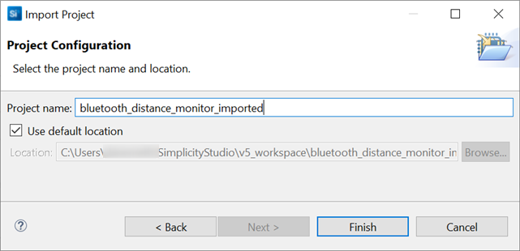

# Usage
This section contains information on how to add the Third Party Hardware Drivers GSDK Extension, and import Application Example projects into Simplicity Studio.

## Importing Simplicity Studio projects
Simplicity Studio projects typically stored under the SimplicityStudio folder inside each project's folder in the the Git repositories.

### File Formats

* ***.sls**

  Legacy projects provide *.sls files. These Simplicity Studio files contain each source files required to build the project (except GSDK files).

* ***.slcp**
  
  Newer projects provides only *.slcp files, these files contain the project configuration, such as the configured software components, source files, headers, includes paths etc.

* ***.btconf**

    This file contains configuration interpreted by the Bluetooth GATT Configurator Tool, it contains the GATT database with the configured services and characteristics.
* ***.pintool**

    Configuration file used by the Pin Tool, these files contains hardware pin assignments and mode configurations. 

### Importing *.sls projects

* **[File] -> [Import]**

  
* Select a folder containing *.sls file(s). Select a project from the detected projects list and click on **Next**.

  

* Click on **Next**
  
  

* Type a name to the new project or keep the original naming. Click on **Finish**.

  

The selected Simplicity Studio project is imported into your workspace. You can compile the project, and run the executable on a real hardware like a development kit.

## Adding SDK Extensions for Hardware Drivers
