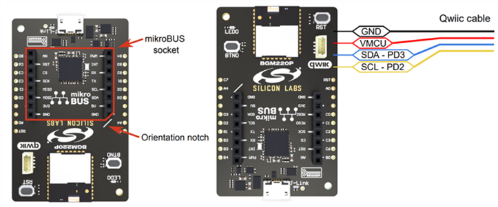

# Requirements

## Hardware

### Development Kits
> The required development kit is defined for each application example. Information on the required development kit is described in the project's readme files in the repository of the example.

**The most frequently used development, starter and explorer kits are listed in the table below.**

|Description|Identifier|Documentation/Links|
| --- | --- | --- |
|EFR32xG22 Wireless Gecko Starter Kit|SLWSTK6021A|[SLWSTK6021A](https://www.silabs.com/development-tools/wireless/efr32xg22-wireless-starter-kit?tab=overview)|
|BGM220 Bluetooth Module Explorer Kit|BGM220-EK4314A|[BGM220-EK4314A](https://www.silabs.com/development-tools/wireless/bluetooth/bgm220-explorer-kit?tab=overview)|
|Thunderboard Sense 2|SLTB004A|[SLTB004A](https://www.silabs.com/development-tools/thunderboard/thunderboard-sense-two-kit?tab=overview)|
|EFR32xG24 Dev Kit|SLWSTK6021A|[xG24-DK2601B](hhttps://www.silabs.com/development-tools/wireless/efr32xg24-dev-kit?tab=overview)|

### Third Party Hardware

The hardware drivers and some of the virtual applications require third party hardware. These third party hardware boards can be purchased from the following suppliers. 

> The documentation of each hardware driver and application example describes the required type of third party board.

**The most frequently used third party suppliers**

|Supplier|Link|
| --- | --- |
||[https://www.mikroe.com](https://www.mikroe.com)|
||[https://www.sparkfun.com](https://www.sparkfun.com)|
||[https://www.adafruit.com](https://www.adafruit.com)|

## Software

### Development Environment
Simplicity Studio is the core development environment designed to support the Silicon Labs IoT portfolio of system-on-chips (SoCs) and modules. It provides access to target device-specific web and SDK resources; software and hardware configuration tools; an integrated development environment (IDE) featuring industry-standard code editors, compilers and debuggers; and advanced, value-add tools for network analysis and code-correlated energy profiling.

[Download Simplicity Studio](https://www.silabs.com/developers/simplicity-studio)

[Simplicity Studio Overview](https://docs.silabs.com/simplicity-studio-5-users-guide/latest/ss-5-users-guide-overview/)

### Software Development Kit

The required GSDK version is described in the readme files for each project.

 > In general, GSDK **v4.x.x** version or higher is required to compile and run the examples.

 Some of the examples require 
 [Third Party Hardware Driver GSDK Extension](https://github.com/SiliconLabs/platform_hardware_drivers_sdk_extensions).

## Setup

Silabs development kits can be connected to any third party shield via simple wiring, however most of the boards are supporting quick and easy connectivity via Qwiic and mikroBUS connectors.

### Mikroe Click Boards

MikroElektronika Click boards can be connected to host controllers via the [mikroBUS](https://download.mikroe.com/documents/standards/mikrobus/mikrobus-standard-specification-v200.pdf) connectors, see the pinout specification below.

### Sparkfun [Qwiic]() or Adafruit [STEMMA QT](https://learn.adafruit.com/introducing-adafruit-stemma-qt/what-is-stemma-qt) Boards

The sparkfun Qwiic and Adafruit STEMMA QT capable boards using the same 4 pins - JST SH 1.0mm pitch connectors to provide quick and easy I2C connectivity between development kits and third party boards.

All Qwiic/STEMMA QT cables have the following color scheme and arrangement:
- Black = GND
- Red = 3.3V
- Blue = SDA
- Yellow = SCL

### BGM220 Bluetooth Module Explorer Kit

The kit features support for hardware add-on boards via a mikroBus socket and a Qwiic connector. The hardware add-on support allows developers to create and prototype applications using a virtually endless combination of off-the-shelf boards from mikroE, sparkfun, AdaFruit, and Seeed Studios.

### EFR32xG22 Wireless Gecko Starter Kit/ Thunderboard Sense 2 / EFR32xG24 Dev Kit

Mikroe provides a [Silabs Click Shield](https://www.mikroe.com/silabs-click-shield) for easily connecting Silabs development kits from the Thunderboard family or any other Silabs wireless or MCU starter kit through the expansion header (EXP) to the Mikroe Click boards.

Sparkfun Qwiic/Adafruit STEMMA QT boards also can be connected to these development kits through the expansion header.

Mikroe Click Temperature sensor board connected to a Thunderboard Sense 2 via a Silabs Click shield. 

