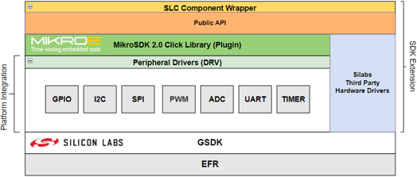

# Third Party Hardware Drivers

Third Party Hardware Drivers is a GSDK Extension to provide support for third party external hardware.

- **Scaling GSDK functionality with SDK Extension**
   - One-click solution for tested 3rd party sensor boards
   - Developed wrapper can be used, to add not tested boards easily
- **Accelerate Design Phase**
  - Quick and easy integration of 1,100+ devices, manufactured by different board providers
  - 10x faster, than developing individual HW drivers from scratch
- **Customer Self-Serve support**
  - Easy to start, fast to learn, time-saving
  - Based on 3rd party boards, diverse Applications can be created

This extension consumes the [MikroSDK Click Plugin](https://github.com/MikroElektronika/mikrosdk_click_v2) for the [MikroSDK](https://github.com/MikroElektronika/mikrosdk_v2) developed by [Mikroe](https://www.mikroe.com/).

**See the [instructions](/application-examples/<docspace-docleaf-version>/ae-getting-started/how-do-you-use-it#adding-sdk-extensions-for-hardware-drivers) of the Section Getting Started for more information.**

## Software Components

The following drivers are tested and integrated into the extension. 

Besides the integrated drivers, it is possible to add additional drivers from the [MikroSDK Click Plugin Repository](https://github.com/MikroElektronika/mikrosdk_click_v2) by using the [Services] -> MikroSDK Peripheral Drivers software components. 
The following drivers implement the required peripheral driver interfaces for the MikroSDK Click plugin.

### **Audio & Voice**
 - CMT_8540S_SMT - Buzz 2 Click (Mikroe)

### **Display & LED**
 - SSD1306 - Micro OLED Breakout (Sparkfun) [I2C]
 - SSD1306 - OLEDW Click (Mikroe) [SPI]

### **Motor Control**
 - LB11685AV - Brushless 16 Click (Mikroe)

### **Sensors**
 - BMA400 - Accel 5 Click (Mikroe)
 - CAP1166 - Capacitive Touch 2 Click (Mikroe)
 - MAXM86161 - Heart Rate 2 Click (Mikroe)
 - Pocket Geiger Radiation - Type 5 (Sparkfun)
 - SHTC3 - Temp&Hum 9 Click (Mikroe)

### **Wireless Connectivity**
 - ID-12LA - RFID Reader (Sparkfun) [I2C]

### **Services**
- GLIB OLED Graphics Library
- MikroSDK Peripheral Drivers
  - I2C
  - PWM
  - SPI
  - ADC