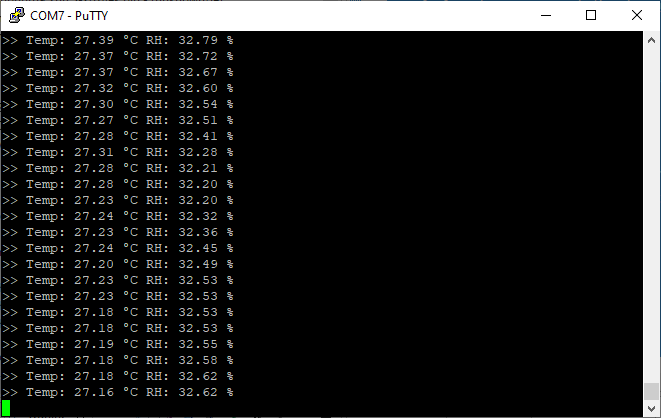

# Third-Party Hardware Drivers

Third-Party Hardware Drivers are GSDK Extension to provide support for third-party external hardware.

- **Scaling GSDK functionality with SDK Extension**
   - One-click solution for tested third-party sensor boards
   - Developed wrapper can be used to add untested boards easily
- **Accelerate Design Phase**
  - Quick and easy integration of 1,100+ devices manufactured by different board providers
  - 10x faster than developing individual HW drivers from scratch
- **Customer Self-Serve Support**
  - Easy to start, fast to learn, time-saving
  - Based on third-party boards, diverse applications can be created


This extension consumes the [mikroSDK Click Plugin](https://github.com/MikroElektronika/mikrosdk_click_v2) for the [mikroSDK](https://github.com/MikroElektronika/mikrosdk_v2) developed by [Mikroe](https://www.mikroe.com/).


**See the [instructions](/application-examples/<docspace-docleaf-version>/ae-getting-started/how-do-you-use-it#adding-sdk-extensions-for-hardware-drivers) of the Getting Started section for more information.**

## Software Components

### **Audio & Voice**
 - CMT_8540S_SMT - Buzz 2 Click (Mikroe)

### **Display & LED**
 - MAX6969 - UT-M 7-SEG R Click (Mikroe)
 - SSD1306 - Micro OLED Breakout (Sparkfun) - I2C
 - SSD1306 - OLED W Click (Mikroe) - SPI

### **Human Machine Interface**
 - A-172-MRQ - Fingerprint 2 Click (Mikroe)
 - CAP1166 - Capacitive Touch 2 Click (Mikroe)
 - Qwiic Joystick (Sparkfun)

### **Interface**
 - W5500 - ETH WIZ Click (Mikroe)

### **Miscellaneous**
 - LCA717 - Relay 2 Click (Mikroe)

### **Motor Control**
 - LB11685AV - Brushless 16 Click (Mikroe)

### **Power Management**
 - MAX17048 - MAX17048EVKIT Evaluation Kits (Maxim)

### **Sensors**
 - AK9753 - Human Presence Sensor (Sparkfun) - I2C
 - AS7265x - Triad Spectroscopy Sensor (Sparkfun) - I2C
 - BMA400 - Accel 5 Click (Mikroe)
 - EM3080-W - Barcode 2 Click (Mikroe)
 - MAX30101 & MAX32664  - Pulse Oximeter and Heart Rate Sensor (Sparkfun)
 - MAX30101 - Heart Rate 4 Click (Mikroe)
 - MAXM86161 - Heart Rate 2 Click (Mikroe)
 - MLX90640 - IR Array Breakout (Sparkfun)
 - MM5D91-00 - Radar Click (Mikroe)
 - MMA8452Q - Triple Axis Accelerometer Breakout (Sparkfun)
 - MQ7 - CO Click (Mikroe)
 - Qwiic Soil Moisture Sensor (Sparkfun) - I2C
 - SGP40 - Air Quality Sensor (Sparkfun)
 - SHT40 & SGP40 - Environment 2 Click (Mikroe)
 - SHTC3 - Temp&Hum 9 Click (Mikroe)
 - Type 5 - Pocket Geiger Radiation (Sparkfun)
 - VCNL4040 - Proximity Sensor (Sparkfun)
 - VL53L1X - Distance Sensor Breakout (Sparkfun)
 - Water Detect Click (Mikroe)

### **Services**
 - GLIB - OLED Graphics Library
 - mikroSDK 2.0 SDK - Peripheral Drivers
   - ADC
   - Digital I/O
   - I2C
   - PWM
   - SPI
   - UART

### **Wireless Connectivity**
 - ID-12LA - RFID Reader (Sparkfun) - I2C

The above drivers are tested and integrated into the extension. 

Besides the integrated drivers, it is possible to add additional drivers from the [mikroSDK Click Plugin Repository](https://github.com/MikroElektronika/mikrosdk_click_v2) by using the [Services] -> mikroSDK 2.0 SDK - Peripheral Drivers software components.

Software components in the mikroSDK 2.0 SDK - Peripheral Drivers are implemented as the required peripheral driver interfaces for the MikroSDK Click plugin.

In general, the software components are named in accordance with the following naming convention.

**<IC_NAME> - <BOARD_NAME> (<BOARD_VENDOR>) - \<INTERFACE>**

Which includes,
  - **IC_NAME** - The name of the integrated circuit on the external board. (e.g.,: SSD1306)
  - **BOARD_NAME** - The name of the external board. (OLED W Click) 
  - **BOARD_VENDOR** - External board vendor. (e.g.,: Mikroe, Sparkfun, Adafruit, etc.)
  - **INTERFACE** - Optional parameter to indicate the communication interface in case the SDK extension implements multiple drivers for the same device with different interfaces. (e.g.,: SPI, I2C)

Although, the drivers were mainly developed and tested with specific external boards, in most cases they should work with other boards using the same IC as well.

 **Example**

 SSD1306 - Micro OLED Breakout (Sparkfun) - I2C driver was developed and tested with Sparkfun Micro OLED Breakout board. However, it may be compatible with most OLED displays available on the market, which are controlled by the SSD1306 display controller. To achieve compatibility, changes to the I2C address or display resolution in the configuration by the display board may be required. 

## Integrate new mikroSDK 2.0 Click drivers 

The Third-Party Hardware Drivers extension provides one-click solution for tested hardware drivers allowing you to integrate 30+ hardware drivers into your project with ease.

In addition to the tested hardware drivers, the extension also provides a peripheral driver wrapper to connect easily the mikroSDK 2.0 Click drivers with Silicon Labs GSDK.

If you are not afraid to do some extra development, thanks to the developed wrapper, over 1,100+ hardware drivers can be added to your project from the mikroSDK 2.0 Click library. This will accelerate the design phase and provide you with a greater level of customer self-serve support.


This chapter is aimed to guide you in integrating a hardware driver from the mikroSDK 2.0 Click library using the wrappers from the *mikroSDK 2.0 SDK - Peripheral Drivers* components.

Currently, the following peripherals are supported:
   - ADC
   - Digital I/O
   - I2C
   - PWM
   - SPI
   - UART

In general, drivers in the mikroSDK 2.0 Click library provide interfaces for initializing and configuring the drivers. 
* **<driver_name>_cfg_setup** function
* **<driver_name>_init** function

### Configuration
Configuration interfaces are used to configure the peripheral-related configuration parameters, such as pin assignments, speed, and address values for the communication interface.

The required configuration parameters are defined in the configuration structure of the drivers. (**<driver_name>_cfg_t** structure)

Pin configuration and other interface specific settings are provided by the GSDK via the component instances. 

In general, you should invoke the <driver_name>_cfg_setup function and there is no need to configure the parameters available in the configuration structure.

### Initialization
Interfaces for initializing the drivers require a click context object and a click driver configuration object to perform the correct initialization of the driver.

Click context objects typically contain an interface for the peripheral driver.

The peripheral interface objects provide a handler for the platform-dependent peripheral driver and also provide variables to store the device-specific parameters, such as the address of the device for I2C interfaced hardware.

**This handler must be configured before calling the <driver_name>_init function.**

The approach and steps to integrate drivers for devices using different interfaces are similar. 
You can find examples in the table below.

**Examples for integrate drivers using different interfaces**

|Interface|Circuit|Click Board|Example|
| --- | --- | --- | --- |
|ADC|MQ-7|[CO Click](https://www.mikroe.com/co-click)|[Link](https://github.com/SiliconLabs/third_party_hw_drivers_extension/tree/master/driver/public/mikroe/co_mq7)|
|I2C|SHTC3|[Temp-Hum 9 Click](https://www.mikroe.com/temphum-9-click)|[Link](https://github.com/SiliconLabs/third_party_hw_drivers_extension/tree/master/driver/public/mikroe/temphum9_shtc3)|
|PWM|CMT-8540S-SMT|[Buzz 2 Click](https://www.mikroe.com/buzz-2-click)|[Link](https://github.com/SiliconLabs/third_party_hw_drivers_extension/tree/master/driver/public/mikroe/buzz2_cmt_8540s_smt)|
|SPI|W5500|[ETH WIZ Click](https://www.mikroe.com/eth-wiz-click)|[Link](https://github.com/SiliconLabs/third_party_hw_drivers_extension/tree/master/driver/public/mikroe/eth_wiz_w5500)|
|UART|EM3080W|[Barcode 2 Click](https://www.mikroe.com/barcode-2-click)|[Link](https://github.com/SiliconLabs/third_party_hw_drivers_extension/tree/master/driver/public/mikroe/barcode2_em3080w)|

In the following section, you can find a detailed guideline for integrating a driver from the mikroSDK 2.0 Click library using the I2C interface.


### Basic integration steps

* **STEP 0** Select and download a driver from the [mikroSDK 2.0 Click library](https://github.com/MikroElektronika/mikrosdk_click_v2).

  **Make sure that the selected driver using a supported communication interface. See the supported interfaces above.** 

* **STEP 1.1 - Optional** Add the Third-Party Hardware Drivers extension. See the instructions in detail [here](/application-examples/<docspace-docleaf-version>/ae-getting-started/how-do-you-use-it#adding-sdk-extensions-for-hardware-drivers).

* **STEP 1.2 - Optional** Connect your board to the PC via a USB cable.

* **STEP 1.3** Open the **Launcher** perspective in Simplicity Studio, and select the target board.

* **STEP 2** Create a new empty project using an empty project template. (e.g.: **Empty C Project**) 
* **STEP 3** Install the required mikroSDK 2.0 Peripheral Driver components from the Third-Party Hardware Drivers extension.

  (e.g.: If the selected board using I2C to communicate with the host controller, then install the  [Third Party Hardware Drivers] -> [Services] -> [mikroSDK 2.0 SDK - Peripheral Drivers] -> I2C component.)

* **STEP 4** Install additional components your project requires. (e.g.: Log, Assert, etc.)

  Default I2CSPM instance is "mikroe", make sure that your I2CSPM instance is configured properly for the target board. 

* **STEP 5** Copy and paste the new driver into the projects folder.
* **STEP 6** Add the <driver_folder>/lib/include folder to the list of include directories in the project configuration.
* **STEP 7** Exclude the <driver_folder>/example/ *.c files from the build.

At this point the new project is ready to integrate the new driver. 

* **STEP 8** Add objects for the click context and click configuration as global variables.
* **STEP 8.1** Create a custom init function for your new driver.
* **STEP 8.2** Set/configure the peripheral driver handler in the click context object. This handler should point to an existing peripheral instance.
* **STEP 8.3** Invoke the <driver_name>_cfg_setup function from your custom init function.
* **STEP 8.4** Invoke the <driver_name>_init function from your custom init function.
* **STEP 9** Invoke your custom init function from app_init.
* **STEP 10** Implement your application logic. (Integrate the driver APIs.)
* **STEP 11** Build the project.
* **STEP 12** Test the application on a target device.

### Example - Integrate the SHTC3 Temperature and Humidity sensor driver

**Select and download a driver from the mikroSDK 2.0 Click Library**

* **STEP 0** Select and download the temphum9 driver.

**Create a new project**

* **STEP 1** Open the **Simplicity Studio**
* **STEP 2** Add the **Third-Party Hardware Drivers extension**, see details [here](/application-examples/<docspace-docleaf-version>/ae-getting-started/how-do-you-use-it#adding-sdk-extensions-for-hardware-drivers).
* **STEP 3** Connect your board to the PC via a USB cable
* **STEP 4** Open the **Launcher** perspective in Simplicity Studio, select the target board
* **STEP 5** Select the **EXAMPLE PROJECTS & DEMOS** tab in the launcher view
* **STEP 6** Select an empty template project (e.g.: **Empty C Project**), click on the **Create** button
* **STEP 7** Give a name for the new project and click on the **Finish** button

**Add required peripheral drivers from the TPHD extension**

The SHTC3 Sensor has an I2C interface to communicate with the host microcontroller. You should check the required interface(s) needed by the external hardware you want to integrate the driver for. 


* **STEP 1** Open the project configuration by double clicking on the *.slcp file in the project's folder.**
* **STEP 2** Select the software components tab in the project configuration view.
* **STEP 3** Enable the extension and clear the quality filters.
* **STEP 4** Install the I2C wrapper from [Third Party Hardware Drivers] -> [Services] -> [mikroSDK 2.0 SDK - Peripheral Drivers] -> I2C.


* **STEP 5** Install Log, and Sleep Timer components
  * [Application] -> [Utility] -> Log
  * [Services] -> [Timers] -> Sleep Timer

The default I2CSPM instance is "mikroe". Make sure that your I2CSPM instance is configured properly for the target board. 

See an example configuration for the EFR32xG24 Explorer Kit below.


Once the I2C software component is installed, the header and source files provided by this component will be available in the project's file structure.


The driver will use the I2C peripheral interfaces provided by the **drv_i2c_master.h** header file in the background.

**Add driver source files to the project**

Download the driver source files from the [mikroSDK 2.0 Click library](https://github.com/MikroElektronika/mikrosdk_click_v2).

* **STEP 1** Copy and paste the driver's folder containing the source files for the selected driver


* **STEP 2** Exclude the main.c and other *.c files from the temphum9/lib/example folder


* **STEP 3** Append the temphum9/lib/include folder to the list of the include directories


* **STEP 4** Enable printf for floating point numbers


**Integrate the driver**

* **STEP 1** Open the app.c file

* **STEP 2** Create a custom init function for the driver and add the required driver and driver config instances to the project.

``` c
#include "app_log.h"
#include "sl_status.h"
#include "sl_i2cspm_instances.h"
#include "sl_sleeptimer.h"

#include "temphum9.h"

static temphum9_t temphum9;
static temphum9_cfg_t temphum9_cfg;
static sl_sleeptimer_timer_handle_t handle_periodic;

sl_status_t mikroe_custom_shtc3_init(sl_i2cspm_t *i2cspm_instance);
void measure_periodic(sl_sleeptimer_timer_handle_t *handle, void *data);

sl_status_t mikroe_custom_shtc3_init(sl_i2cspm_t *i2cspm_instance)
{
  if (NULL == i2cspm_instance) {
    return SL_STATUS_INVALID_PARAMETER;
  }
  // Configure default i2csmp instance
  temphum9.i2c.handle = i2cspm_instance;

  // Call basic setup functions
  temphum9_cfg_setup(&temphum9_cfg);

  return temphum9_init(&temphum9, &temphum9_cfg) ? SL_STATUS_FAIL : SL_STATUS_OK;
}

```

The mikroSDK driver provides the temphum9_t and temphum9_cfg_t types to configure the driver.

``` c
typedef struct
{
    // Modules 

    i2c_master_t i2c;

    // ctx variable 

    uint8_t slave_address;

} temphum9_t;

typedef struct
{
    // Communication gpio pins 

    pin_name_t scl;
    pin_name_t sda;

    // static variable 

    uint32_t i2c_speed;
    uint8_t i2c_address;

} temphum9_cfg_t;
```

**Silicon Labs wrapper provides the high level configuration for the I2CSPM instance, therefore it is not required to configure the speed, pin, or any other parameters except the i2c parameter in the temphum9_t type.**

**Only the i2c.handle pointer should be configured to point to the configured I2CSPM instance.**

**Please check the provided drivers as examples for other peripheral (SPI, UART, etc.) integration.**

**Initialization**

``` c
void app_init(void)
{

  if (SL_STATUS_OK != mikroe_custom_shtc3_init(sl_i2cspm_mikroe)) {
    app_log("TempHum9 initialization failed.");
  } else {
    app_log("TempHum9 initialization succeed.");

    sl_sleeptimer_start_periodic_timer_ms(&handle_periodic, 1000,
        measure_periodic, NULL, 0, 0);
  }
}
```

**Reading and printing the measured values**

``` c
void measure_periodic(sl_sleeptimer_timer_handle_t *handle, void *data)
{
  (void) handle;
  (void) data;

  float _measurement_data[2];
  temhum9_get_temperature_and_humidity(&temphum9, TEMPHUM9_NORMAL_MODE,
      _measurement_data);
  app_log(">> Temp: %.2f °C RH: %.2f %%\n", _measurement_data[0],
      _measurement_data[1]);
}
```

**The whole example app.c**

``` c
#include "app_log.h"
#include "sl_status.h"
#include "sl_i2cspm_instances.h"
#include "sl_sleeptimer.h"

#include "temphum9.h"

static temphum9_t temphum9;
static temphum9_cfg_t temphum9_cfg;
static sl_sleeptimer_timer_handle_t handle_periodic;

sl_status_t mikroe_custom_shtc3_init(sl_i2cspm_t *i2cspm_instance);
void measure_periodic(sl_sleeptimer_timer_handle_t *handle, void *data);

sl_status_t mikroe_custom_shtc3_init(sl_i2cspm_t *i2cspm_instance)
{
  if (NULL == i2cspm_instance) {
    return SL_STATUS_INVALID_PARAMETER;
  }
  // Configure default i2csmp instance
  temphum9.i2c.handle = i2cspm_instance;

  // Call basic setup functions
  temphum9_cfg_setup(&temphum9_cfg);

  return temphum9_init(&temphum9, &temphum9_cfg) ? SL_STATUS_FAIL : SL_STATUS_OK;
}

/***************************************************************************//**
 * Initialize application.
 ******************************************************************************/
void app_init(void)
{

  if (SL_STATUS_OK != mikroe_custom_shtc3_init(sl_i2cspm_mikroe)) {
    app_log("TempHum9 initialization failed.");
  } else {
    app_log("TempHum9 initialization succeed.");

    sl_sleeptimer_start_periodic_timer_ms(&handle_periodic, 1000,
        measure_periodic, NULL, 0, 0);
  }
}

void measure_periodic(sl_sleeptimer_timer_handle_t *handle, void *data)
{
  (void) handle;
  (void) data;

  float _measurement_data[2];
  temhum9_get_temperature_and_humidity(&temphum9, TEMPHUM9_NORMAL_MODE,
      _measurement_data);
  app_log(">> Temp: %.2f °C RH: %.2f %%\n", _measurement_data[0],
      _measurement_data[1]);
}

/***************************************************************************//**
 * App ticking function.
 ******************************************************************************/
void app_process_action(void)
{

}
```

* **Build and flash the application**

If you connect the Temphum9 board to the Explorer Kit, the driver and the demo application should operate properly and you should be able to read the temperature and humidity measurements.

**Output**

