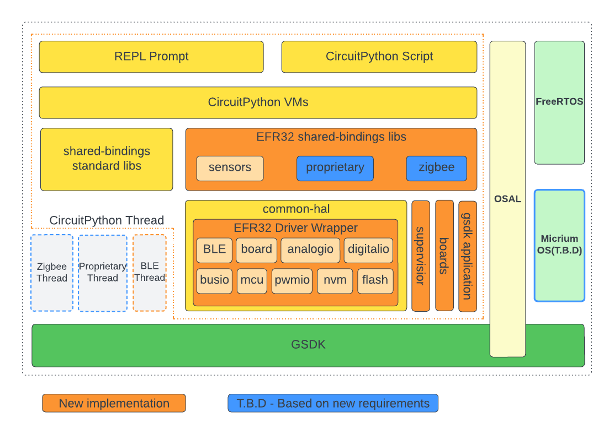
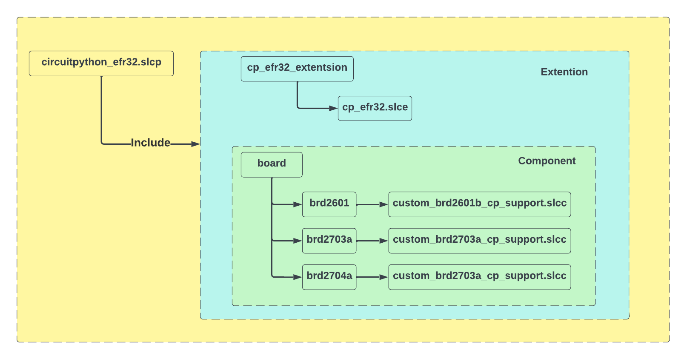

# Introduction

CircuitPython is a programming language designed to simplify experimenting and learning to code on low-cost microcontroller boards. Unlike traditional programming languages, CircuitPython is easy to learn and use, making it a great choice for beginners or anyone who wants to quickly create projects without having to spend a lot of time learning complicated programming concepts.

CircuitPython supports for a wide range of microcontrollers, including those made by popular manufacturers. This allows users to choose the microcontroller that best fits their needs and use CircuitPython to control it.

We have already successfully ported CircuitPython to the Silabs xG24, making this powerful programming language available to developers who want to create innovative and exciting projects using our hardware.

## Systems Overview
This is an implementation of CircuitPython for the xG24.

On the xG24 chips, CircuitPython is run on a thread in the Dynamic Multiprotocol system. The RTOS can be selected between FreeRTOS or Micrium OS. There are also other threads for Zigbee, BLE, and Proprietary corresponding with protocols. Currently, only BLE is supported.

Supporting protocols requires writing additional custom modules in shared-bindings.

Since the system uses the SLC tool to create the project, configuring the components of the Gecko SDK is quite easy.

The system utilizes the SLC tool to generate the make file. A separate slcc file is required for each board.

## Supported Kits

This port provides support for three xG24 boards, which are listed below:

* **[EFR32xG24 Dev Kit](https://circuitpython.org/board/silabs_devkit_xg24_brd2601b/)** 
* **[EFR32xG24 Explorer Kit](https://circuitpython.org/board/silabs_explorerkit_xg24_brd2703a/)**
* **[SparkFun Thing Plus Matter MGM240P](https://circuitpython.org/board/sparkfun_thing_plus_matter_mgm240p/)**

## Module Support Matrix
The following lists the available built-in modules for xG24 board, as well as each frozen module included on.

**Built-in modules available**: _asyncio, _bleio, _pixelmap, adafruit_bus_device, adafruit_pixelbuf, aesio, analogio, array, atexit, binascii, bitmaptools, board, builtins, busio, collections, digitalio, displayio, errno, fontio, framebufferio, getpass, gifio, json, math, microcontroller, msgpack, nvm, onewireio, os, pwmio, rainbowio, random, re, rtc, sdcardio, select, sharpdisplay, storage, struct, supervisor, sys, terminalio, time, traceback, ulab, vectorio, watchdog, zlib

**Included frozen modules**: adafruit_ble, adafruit_register
